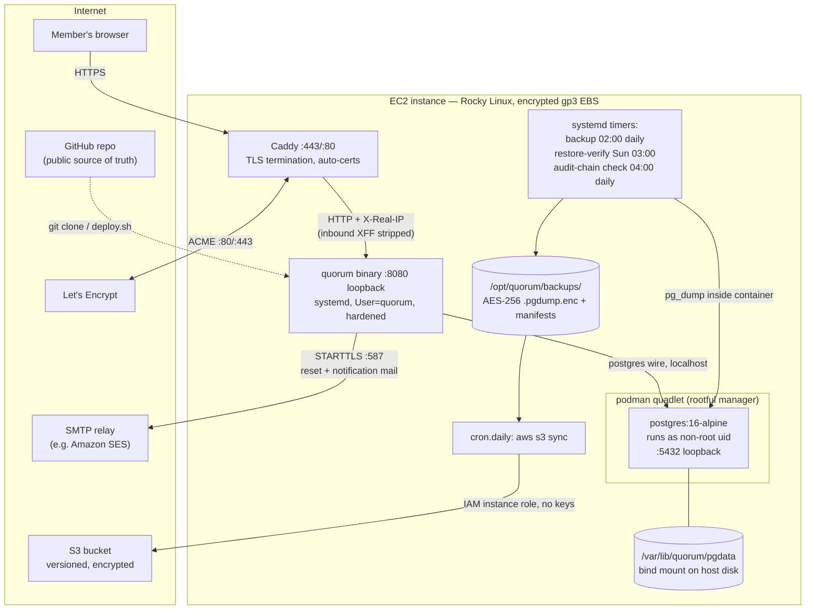
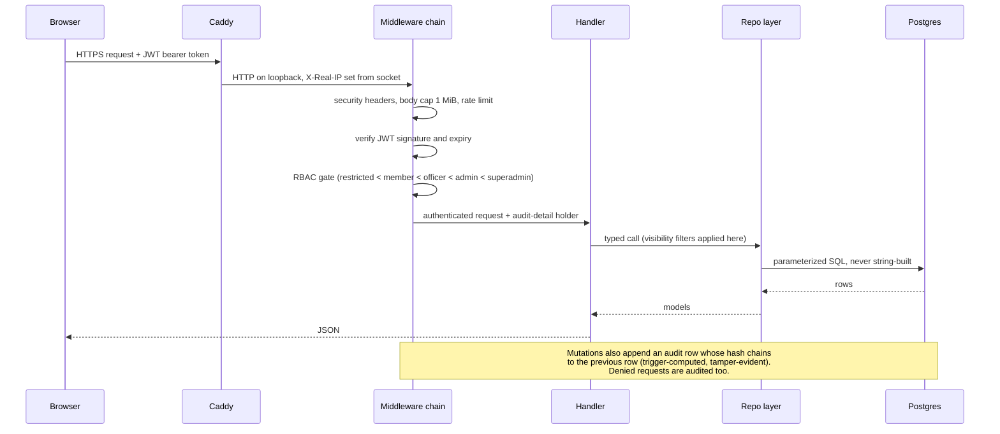
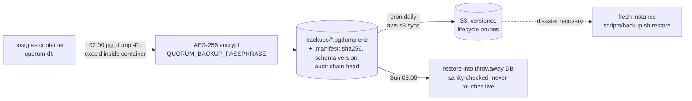
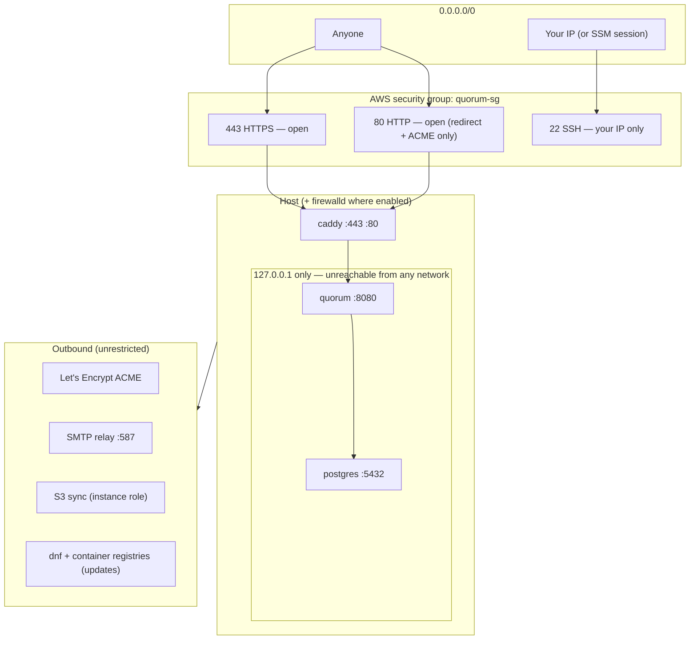

# Architecture, Data Flow & Network Reference

Diagrams for the recommended single-instance deployment (see
[DEPLOY-EC2.md](DEPLOY-EC2.md)). GitHub renders these natively; they use
`example.org` as the placeholder domain.

## 1. System architecture — what runs where

Key invariants:

- Only Caddy faces the internet. The app and database bind loopback only.
- The app process writes nothing to disk (`ProtectSystem=strict`); backups
  run in separate units.
- The database's state lives on the host bind mount, not in the container
  image — images are replaceable software, the volume is the data.

## 2. Request data flow — one authenticated API call

Trust boundaries worth remembering:

- **TLS ends at Caddy**; loopback traffic is plaintext but never leaves the
  kernel of the one machine.
- **Identity is the JWT**, minted only by `/auth/login` (+ optional 2FA) and
  refreshed by rotating refresh tokens; token age doubles as the idle-logout
  clock, enforced server-side.
- **Resource visibility** is enforced in the repo layer (groups), so a
  hidden record 404s identically to a missing one.

## 3. Backup & recovery data flow

Chain of custody: each manifest records the audit-chain head at dump time,
so a restored database can be checked for tampering against the last known
head (`quorum -verify-audit`).

## 4. Network diagram — who may talk to whom

Never open: 8080 (app), 5432 (database). If a future need says otherwise,
the answer is a VPN or SSH tunnel, not a security-group rule.
